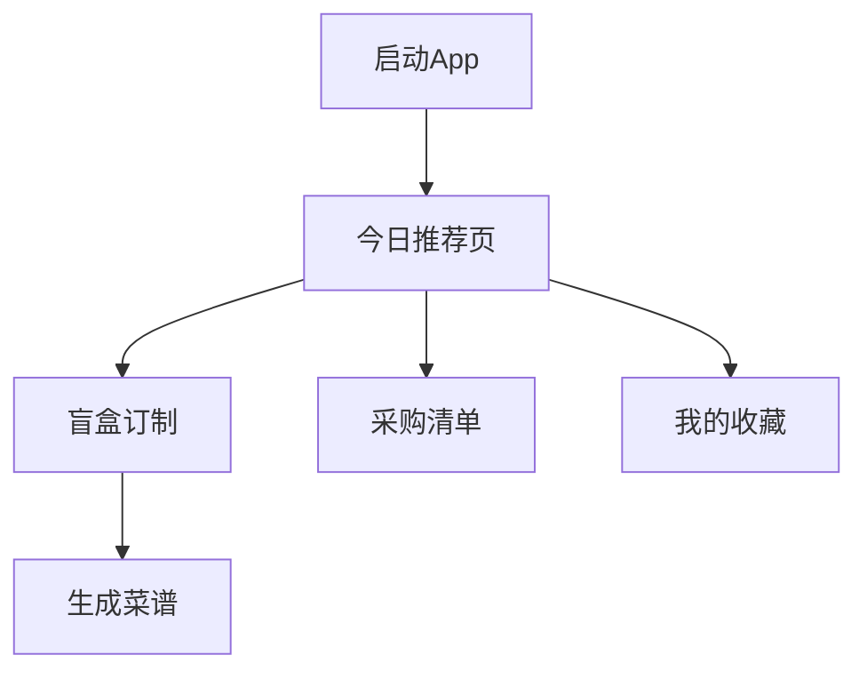

# 轻食菜谱 Web App 产品需求文档

## 1. 产品概述

一款专为手机用户设计的轻食菜谱应用，以清新治愈的牛油果绿和奶油白为主色调，帮助用户发现健康美味的轻食食谱、管理采购清单、收藏心仪菜谱。

- **核心目标**：让健康饮食变得简单有趣
- **目标用户**：追求健康生活的都市年轻人、轻食爱好者
- **产品价值**：提供便捷的菜谱浏览、个性化盲盒订制、清晰的采购管理

## 2. 核心功能

### 2.1 功能模块

1. **今日推荐**：展示精选轻食菜谱卡片，包含配图、名称、烹饪时间、难度标签
2. **盲盒订制**：用户输入偏好（口味、食材、烹饪时间），生成个性化菜谱组合
3. **采购清单**：管理食材采购列表，支持添加、删除、勾选完成
4. **我的收藏**：收藏喜欢的菜谱，方便随时查看

### 2.2 页面详情

| 页面名称 | 模块名称 | 功能描述 |
|---------|---------|---------|
| 今日推荐 | 菜谱卡片列表 | 展示推荐菜谱，支持点击查看详情占位 |
| 盲盒订制 | 偏好选择器 | 选择口味、食材类型、烹饪时间，生成菜谱 |
| 采购清单 | 清单管理 | 添加/删除食材，勾选已完成项 |
| 我的收藏 | 收藏列表 | 展示收藏的菜谱卡片 |

## 3. 核心交互流程

用户打开 App → 底部 Tab 切换不同页面 → 点击菜谱可进入详情（暂为占位页）

## 4. 用户界面设计

### 4.1 设计风格

- **主题色**：牛油果绿 `#8DB600`、深绿 `#6B8E23`、奶油白 `#FFFEF0`、浅米色 `#F5F5DC`
- **按钮风格**：圆角按钮，柔和阴影
- **字体**：圆润现代的无衬线字体
- **布局**：移动端优先，卡片式布局
- **图标**：线性图标风格

### 4.2 页面设计概览

| 页面名称 | 模块名称 | UI 元素 |
|---------|---------|---------|
| 全局 | 底部导航栏 | 4个Tab图标+文字，当前Tab高亮 |
| 今日推荐 | 菜谱卡片 | 圆角卡片，缩略图+标题+标签 |
| 盲盒订制 | 选项卡片 | 可点击选择的选项组 |
| 采购清单 | 清单项 | 带勾选框的列表项 |
| 我的收藏 | 收藏卡片 | 与推荐页类似的菜谱卡片 |

### 4.3 响应式设计

- 移动端优先（375px - 428px）
- 底部导航栏固定在屏幕最下方
- 内容区域可滚动，导航栏保持固定
