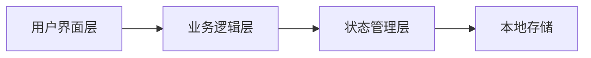

# 轻食菜谱 Web App 技术架构文档

## 1. 架构设计



- **前端**：React@18 + Tailwind CSS + Vite
- **状态管理**：React useState
- **路由**：Tab 切换使用 useState 管理
- **数据**：Mock 数据展示，无后端

## 2. 技术选型

- 前端框架：React@18
- 构建工具：Vite
- 样式方案：Tailwind CSS
- 图标库：Lucide React（线性图标）

## 3. 路由定义

| 路由状态 | 用途 |
|---------|------|
| tab=home | 今日推荐页 |
| tab=mysterybox | 盲盒订制页 |
| tab=shopping | 采购清单页 |
| tab=favorites | 我的收藏页 |

## 4. 组件结构

```
src/
├── App.jsx              # 主应用组件
├── components/
│   ├── TabBar.jsx       # 底部导航栏组件
│   └── RecipeCard.jsx   # 菜谱卡片组件
├── pages/
│   ├── HomePage.jsx     # 今日推荐
│   ├── MysteryBoxPage.jsx # 盲盒订制
│   ├── ShoppingPage.jsx # 采购清单
│   └── FavoritesPage.jsx # 我的收藏
├── data/
│   └── mockData.js      # 模拟数据
└── index.css            # 全局样式+Tailwind
```

## 5. 状态管理

使用 React useState 管理当前激活的 Tab：

```jsx
const [activeTab, setActiveTab] = useState('home')
```

## 6. 主题配置

Tailwind CSS 自定义牛油果绿主题色：

```js
colors: {
  avocado: {
    light: '#8DB600',
    dark: '#6B8E23',
  },
  cream: {
    light: '#FFFEF0',
    DEFAULT: '#F5F5DC',
  }
}
```
